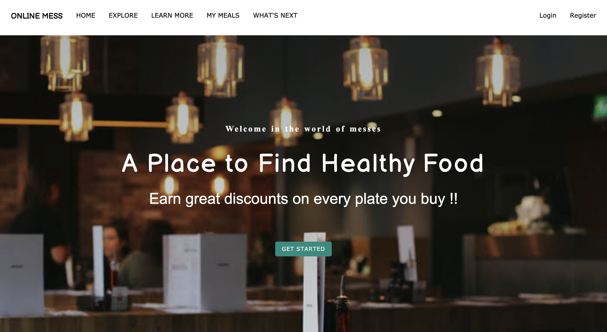
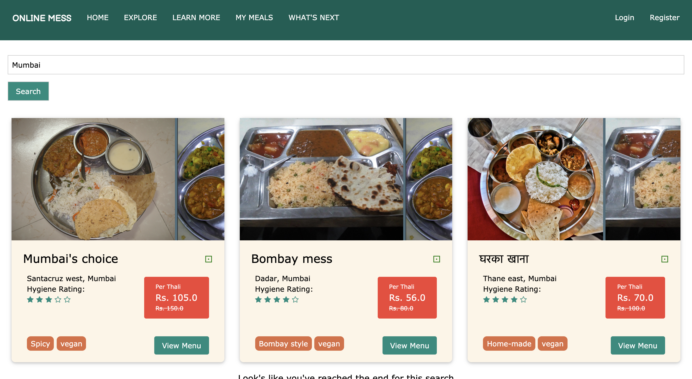
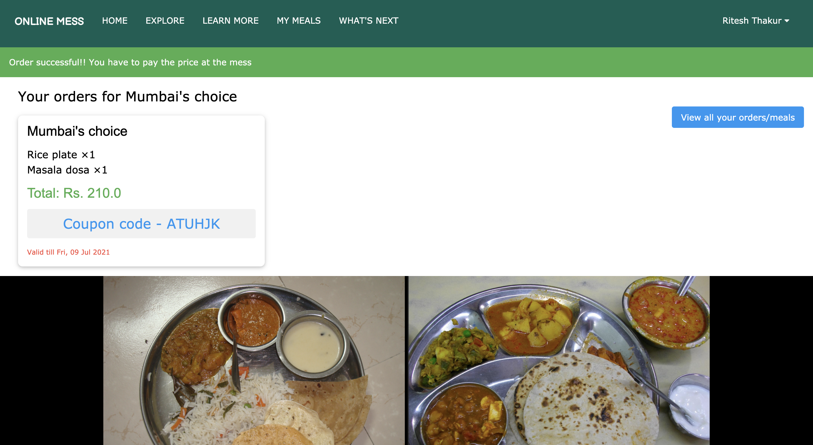
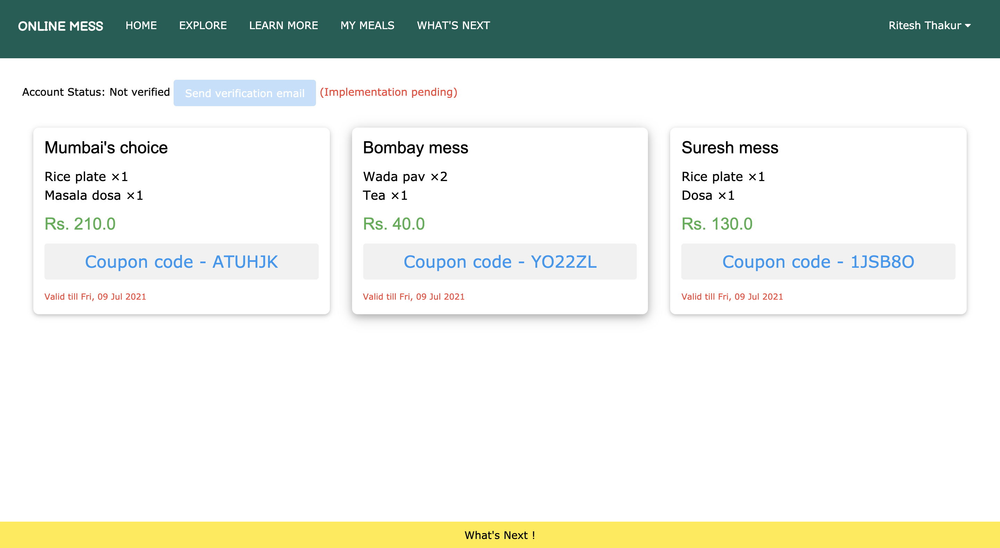
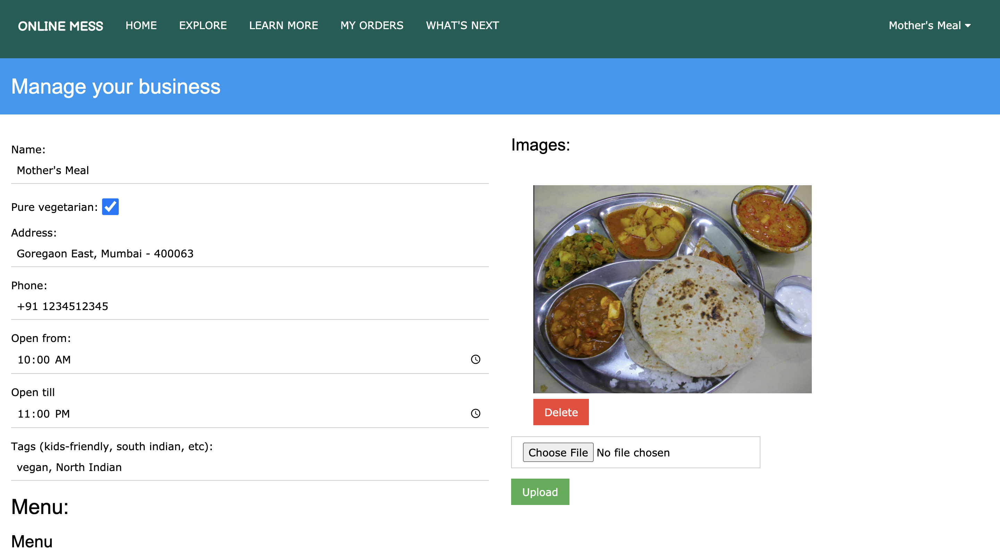
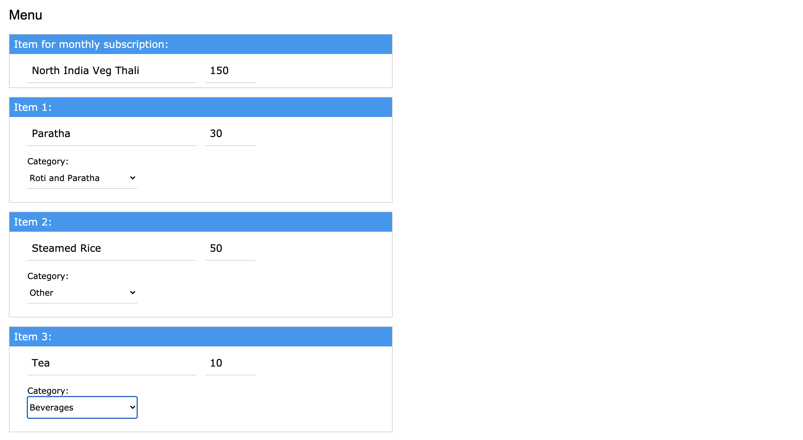

# Online Mess Database 🍱
> Website for ordering food from local restaurants (or messes)

### Features
For users
1. explore variety of restaurants (and messes)
2. use the in-depth search to find restaurants using location, name, menu item, etc.
3. select your favourite food item ans initaite orders

For restaurants
1. add your restaurant and menu easily
2. order creation and tracking
3. coupon based system to avoid order misplacement and possibly fraud

Other features
1. administrator control on restaurants
2. email verification of accounts _(currently disabled)_

### Built using
- Flask (Python)
- Flask-SQLAlchemy
- Bootstrap


## Screenshots
\

_Home page_ \
\
\

_Explore page (search for restaurants using name, location, menu items, tags)_ \
\
\

_Restaurant page (you can also view your orders for the restaurant here itself)_ \
\
\

_My Meals page (view all your orders for all restaurant here)_ \
\
\

_Restaurant registration page_ \
\
\

_Restaurant registration page (with menu shown)_

### Installation
> Make sure you have Python 3.x installed.
```
$ cd Online-Mess-Database
$ pip install -r requirements.txt
$ python main.py
```
_(If you get any python or pip not found errors, try using python3 or pip3 instead)_

Using a Python virtual environment is recommended

```
$ python -m venv online-mess-venv
$ source online-mess-venv/bin/activate
$ pip install -r requirements.txt
```

### Feedback
If you have any new ideas or suggestions regarding this project, you can create a **new feature issue** [here](https://github.com/ritesh-dt/Online-Mess-Database/issues/new) or contact me at <riteshdthakur@gmail.com>